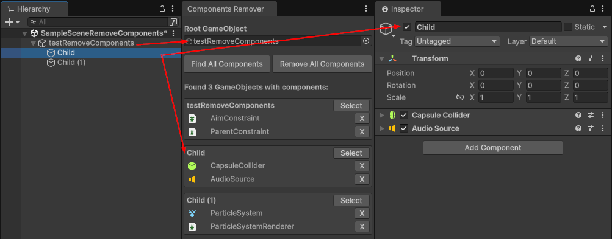

# Components Remover

A Unity Editor tool for removing components from GameObjects in the scene hierarchy.

## How to Open

Menu → **Tools** → **Components Remover**

## Features

### 1. Select Root GameObject

- Drag a GameObject from the Scene Hierarchy into the "Root GameObject" field
- The tool will analyze this GameObject and all its children

### 2. Find All Components

- Click the **"Find All Components"** button
- Displays a list of unique component types found across all GameObjects
- Shows the count of each component type (e.g., "MeshRenderer (5)")
- Lists all GameObjects (including root) that have components besides Transform
- Each component is displayed with a distinctive icon based on its type

### 3. Remove Components by Type

- In the "Unique Component Types" section, click **"Remove all of this type"** next to any component type
- This will remove all instances of that component type from all GameObjects under the root
- Confirmation will be requested before proceeding
- Components required by others (via RequireComponent) will be skipped with a warning

### 4. Individual Removal

- Click the **"X"** button next to a component to remove it
- If a component is required by others (via RequireComponent), a warning will appear

### 5. Remove All Components

- Click **"Remove All Components"** to remove all components from all GameObjects
- Confirmation will be requested before proceeding
- The operation supports Undo (Ctrl+Z)

## Notes

- Transform components are never removed
- All operations support Undo/Redo
- The "Select" button allows quick selection of a GameObject in the Hierarchy
